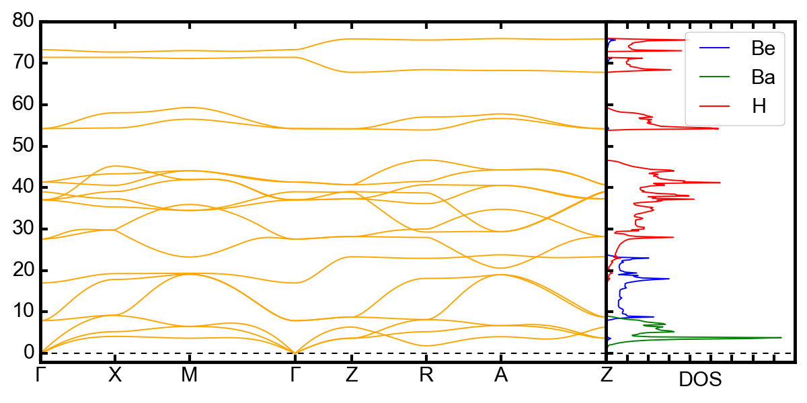

# phtools

Tools for the visualization of phonon results obtained from first-principles claculations.

# Requirements

Pymatgen

Phonopy

Matplotlib

Pandas

Numpy

If you are not sure which libraries are necessary, please use ``pip install requirements.txt' to install the depdencies.

# Examples

Example 01: BeBaH4

# License

MIT License

